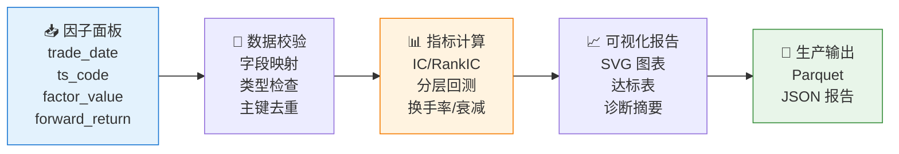

# 📊 skill-factor-evaluation

**简体中文** | [English](README.en.md)

> IC 测试与因子评估体系：为 Alpha 因子研发提供统一、可复用、可落地的 IC 测试、因子评估与可视化报告生成能力。

<p align="center">
  
  
  
  
  
</p>

`skill-factor-evaluation` 是 QuantSkills 组织提供的因子评估 Skill。它用于对 Alpha 因子进行 IC 测试、分层回测、换手率分析、衰减曲线等全方位评估，并生成科研级 HTML 可视化报告。

QuantSkills GitHub 组织：https://github.com/quantskills

## 🎯 这个 Skill 解决什么问题

当你研发了一个新的 Alpha 因子，需要快速、标准化地评估其横截面预测能力时，可以使用本 Skill。

它会自动完成：

- **IC/RankIC 计算**：按交易日横截面计算 Pearson IC、Spearman RankIC、ICIR、t 统计量（含 Newey-West HAC）
- **分层回测**：默认五分组/十分组，输出各组日收益、累计收益、多空累计收益和多空 IR
- **换手率分析**：顶部组合持仓变化的 Jaccard 距离
- **衰减曲线**：多周期 RankIC 衰减（1/2/3/5/10/20 期）
- **单调性检验**：分层收益是否随组别递增
- **分布诊断**：IC 偏度/峰度、因子横截面分布、极端值占比
- **Bootstrap 噪声基线**：零假设 p-value 与置信区间
- **交易成本敏感性扫描**：多组 bps 下的净收益/净 IR
- **行业 + 风格中性化**：横截面 OLS 残差
- **股票池筛选**：全A、沪深300、中证500/1000/2000
- **HTML 可视化报告**：内嵌 SVG 图表，无需外部依赖

## ⚡ 评估流程



## 📦 输入数据要求

输入数据必须包含以下四个核心字段：

| 字段 | 类型 | 说明 |
|---|---|---|
| `trade_date` | date/string | 信号日期 |
| `ts_code` | string | 标的代码 |
| `factor_value` | float | 因子值 |
| `forward_return` | float | 该信号对应的未来收益 |

支持字段别名：`date` → `trade_date`、`asset` → `ts_code`、`factor` → `factor_value`、`return` → `forward_return`

可选多周期收益列（用于衰减曲线）：`forward_return_1d`、`forward_return_2d`、`forward_return_3d`、`forward_return_5d`、`forward_return_10d`、`forward_return_20d`

## 🚀 快速开始

### 安装依赖

```bash
pip install pandas numpy pyarrow
```

### 基础用法

```python
from scripts.build import run, write_report, write_production

# 运行评估
result = run(input_data, config={
    "group_mode": "quintile",       # 五分组
    "turnover_quantile": 0.8,       # 顶部 20% 换手率
    "decay_horizons": [1, 2, 3, 5, 10, 20],
    "annualization_factor": 252,
    "data_version": "your-data-version",
})

# 生成 HTML 报告
report_path = write_report(input_data, "reports/factor_report.html", config={
    "target_id": "my_factor",
    "group_count": 5,
})

# 写入生产 Parquet
write_production(input_data, "生产产物/数据库.parquet", config={
    "data_version": "daily-factor-eval-v1",
})
```

### 命令行调度

```bash
# 单次评估：生成 Parquet + HTML 报告
python scripts/daily_runner.py --input factor_panel.csv --output reports/ --production 生产产物/

# 一键演示（不联网，合成数据）
python scripts/demo.py
python scripts/demo.py --group-mode decile                   # 十分组
python scripts/demo.py --bootstrap-n 200 --cost-grid-bps 1,3,5,10  # 噪声基线 + 成本扫描
```

## ⚙️ 配置项

| 配置 | 默认值 | 说明 |
|---|---|---|
| `group_mode` | `quintile` | 分组模式：`quintile`/`5`/`五分组` 或 `decile`/`10`/`十分组` |
| `group_count` | `5` | 分层数量 |
| `turnover_quantile` | `0.8` | 换手率顶部组合阈值 |
| `decay_horizons` | `[1,2,3,5,10,20]` | 衰减曲线评估周期 |
| `factor_direction` | `positive` | 因子方向：`positive` / `negative` / `auto` |
| `target_kind` | `return` | 目标类型：`return` 或 `binary_success` |
| `annualization_factor` | `252` | 多空 IR 年化倍数 |
| `stock_pool` | `all_a` | 股票池：`all_a`、`hs300`、`zz500`、`zz1000`、`zz2000` |
| `bootstrap_n` | `0` | Bootstrap 噪声基线次数（0=关闭） |
| `cost_grid_bps` | `[]` | 交易成本扫描（单位 bps） |
| `neutralize` | `false` | 是否做行业+风格中性化 |
| `research_diagnostics` | `false` | 是否启用 V7 研究诊断 |

完整配置说明见 [开发产物/references/api_guide.md](开发产物/references/api_guide.md)。

## 📁 项目结构

```
├── 开发产物/
│   ├── SKILL.md              # BUILD 主说明书
│   ├── skill.json            # 元数据
│   ├── demo.mp4              # 演示视频
│   ├── references/           # API 文档、变更日志、样本数据
│   ├── scripts/              # 核心代码
│   │   ├── build.py          # 标准入口：run() / write_production() / write_report()
│   │   ├── daily_runner.py   # 命令行调度入口
│   │   ├── demo.py           # 一键演示入口
│   │   ├── data_io.py        # 数据 I/O 与字段映射
│   │   ├── metrics.py        # 核心评估指标
│   │   ├── stats.py          # 统计检验（Newey-West、Bootstrap、成本扫描）
│   │   ├── neutralize.py     # 行业+风格中性化
│   │   ├── research_diagnostics.py  # V7 研究诊断
│   │   ├── visual/           # HTML 报告渲染
│   │   └── tests/            # 测试套件（38 个测试）
│   └── reports/              # HTML 报告输出目录
├── 生产产物/
│   ├── SKILL.md              # 生产产物说明
│   └── 数据库.parquet         # 生产格式输出
└── demo_output/              # 演示产物
```

## 🧪 运行测试

```bash
# 推荐：使用兼容入口
python scripts/test.py

# 等价路径
python -m pytest scripts/tests -v
```

测试覆盖 38 个用例，包括：输入校验、字段映射、IC/分层计算、HTML 渲染、生产写入、中性化红线复检等。

## 📊 HTML 报告示例

生成的 HTML 报告包含：

- IC 时序与 RankIC 滚动均值
- RankIC 分布直方图
- 累计 IC / 累计 RankIC 曲线
- 分层累计收益曲线
- 分层平均收益单调性柱状图
- 顶部组合换手率时序
- RankIC 衰减曲线
- 因子分布诊断图
- 优质因子特征达标表
- 股票池 / 分组下拉切换

预览报告：[demo_output/demo_report.html](demo_output/demo_report.html)

## 🔗 相关 Skill

- [`skill-quant-factor-skill-factory`](https://github.com/quantskills/skill-quant-factor-skill-factory) - 因子生产工具：批量生成、验证和打包因子 Skill
- [`skill-quant-factor-directional-alpha`](https://github.com/quantskills/skill-quant-factor-directional-alpha) - 方向性 Alpha 因子库
- [`skill-quant-factor-risk-pattern-alpha`](https://github.com/quantskills/skill-quant-factor-risk-pattern-alpha) - 风险模式 Alpha 因子库
- [`skill-quant-factor-volume-stat-alpha`](https://github.com/quantskills/skill-quant-factor-volume-stat-alpha) - 量价统计 Alpha 因子库

## 📄 许可证

本项目基于 GPLv3 许可证开源 - 详见 [LICENSE](LICENSE) 文件。
