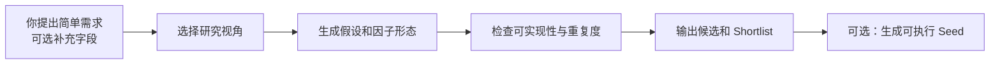

# Factor Idea Generation

**简体中文** | [English](README.en.md)

> 当你没有新的因子思路时，只需说“请帮我想几个”。Skill 会根据默认数据范围生成一批有经济逻辑、具体因子形态和风险说明的候选想法。

这是一个用于**研究起点**的 Community Skill。它负责把“我还能研究什么”变成可以实现和验证的因子候选，但不会宣称这些因子已经有效。

## 最快使用

**使用前提：这个 Skill 已在当前 Agent 中安装或启用。** 仅下载或克隆 GitHub 仓库，不一定会让 Agent 自动识别它。

启用后不需要准备行情 CSV。支持隐式调用的 Agent 可以通过这句话自动触发：

```text
我现在没有因子想法了，请你帮我想几个。
```

如果当前平台没有自动识别，可显式指定：

```text
使用 $factor-idea-generation。
我现在没有因子想法了，请你帮我想几个。
```

此时默认使用日频 `open/high/low/close/volume`，生成 `5` 个候选并选出 `2` 个优先实现。你也可以只指定部分 OHLCV 字段，或明确加入 `amount`、`vwap`、`turnover` 等其他字段。

你会得到：

- 每个候选的研究假设和经济含义。
- 可落地的 `factor_shape`，包括输入、变换、窗口关系和方向。
- 可能失效的市场状态、数据风险和未来信息检查。
- 一份优先实现的 shortlist，以及可选的可执行 seed 代码。

## 什么时候用

| 你的问题 | 这个 Skill 如何帮你 |
|---|---|
| 我没有新的因子想法了 | 从七层研究目录中选择视角并生成候选 |
| 我只会反复做动量或波动率变体 | 用不同 Agent/Lens 扩展机制，并检查伪创新 |
| 我读了一篇论文或研报 | 把其中可实现的视角提取为本轮 Custom Lens |
| 我想把想法交给评估流程 | 输出结构化 idea，并可选转成可执行 seed |

如果你需要的是 RankIC、RankICIR、回测收益或生产交易信号，这个 Skill **不适合单独完成**；这些属于下游实证评估。

## Skill 如何工作



1. **理解约束**：未说明时使用默认日频 OHLCV；若你指定字段，则严格按指定范围生成。
2. **选择视角**：从内置目录和可选外部研究中选择一到两个 Lens。
3. **生成候选**：先提出可反驳假设，再给出具体因子形态，而不是随机堆叠算子。
4. **筛选输出**：检查未来信息、字段可行性、经济逻辑和同质化，然后给出 shortlist。

每次调用生成一批候选。你可以将 shortlist、评估反馈或新研报带入下一次调用，逐步扩展研究空间。

## 你可以提供什么

| 输入 | 是否必需 | 示例 |
|---|---|---|
| 可用字段 | 可选 | 未说明时默认为日频 `open/high/low/close/volume`；也可提供子集或其他字段 |
| 市场、频率、预测 horizon | 可选 | A 股、日频、5 日收益 |
| 候选数量和偏好 | 可选 | 默认生成 5 个、shortlist 2 个；也可指定数量或偏好价量类 |
| 已有因子或失败案例 | 可选 | 用于避免重复方向 |
| 论文、研报或研究笔记 | 可选 | 作为本轮研究上下文 |
| Custom Lens Pack | 可选 | 用户长期维护的 YAML 视角库 |

## 输出长什么样

一个典型候选会包含：

```text
名称：压缩后量价释放强度
假设：持续缩量且价格区间收窄后的同步扩张，可能代表新一轮信息释放。
因子形态：压缩持续度 × 量价扩张的连续确认分数。
失效风险：单日消息冲击可能产生伪突破。
状态：待实现、待实证。
```

结构化输出及交接格式见 [output_schema.md](references/output_schema.md) 和 [handoff_schema.md](references/handoff_schema.md)。

## 加入你自己的研究视角

你有两种方式：

- **仅本轮使用**：在调用时附上论文、研报或笔记，Skill 会提取临时 Custom Lens，但不会改动内置目录。
- **重复使用**：把研究视角整理成 Custom Lens Pack，以后每次都可加载。

示例：

```text
使用 $factor-idea-generation。
请读取 /path/to/research_report.pdf，提取可用 OHLCV 实现的新视角，
与内置目录结合后生成 5 个候选，并标明哪些内容来自该研报。
```

自定义格式见 [custom_lens_schema.md](references/custom_lens_schema.md) 和 [custom_lens_pack.example.yaml](examples/custom_lens_pack.example.yaml)。

<details>
<summary><strong>查看内置七层研究框架</strong></summary>

Skill 内置 7 个 Layer、21 个 Agent 和 119 个 Lens：

1. Market Structure & Cycle
2. Extreme Risk & Fragility
3. Price-Volume Dynamics
4. Price-Volatility Behavior
5. Multi-Scale Complexity
6. Stability & Regime-Gating
7. Geometric & Fusion

Lens 是研究视角，不是固定公式，也不代表已通过实证。完整导航见 [layer_overview.md](references/layer_overview.md)。

</details>

## 与 Factor Pool Evolution 的关系

```text
Factor Idea Generation             Factor Pool Evolution
提出研究假设和初始因子  ->  计算 RankIC / RankICIR / maxCorr
输出 shortlist 或 seed          ->  评估、mutation、crossover
```

## 运行时与边界

- 使用前需先通过平台安装/启用 Skill，或将仓库放入当前 Agent 能识别的 Skills 目录。
- Codex、Claude Code、OpenClaw：读取根目录 [SKILL.md](SKILL.md)。
- Cursor：使用 [agents/cursor-rule.mdc](agents/cursor-rule.mdc)。
- Hermes 或其他 Agent：使用 [agents/portable-loader.md](agents/portable-loader.md)。
- 所有候选都是待验证研究假设，不构成投资建议或收益承诺。
- 本项目不代表 QUANTSKILLS 官方验证、认证、背书或生产可用结论。

## 参与贡献

欢迎通过 Issue 提交研究视角、使用问题或改进建议，也欢迎通过 Pull Request 补充文档、示例和 Lens。新增因子思路时，请同时说明研究假设、所需数据、可能的未来信息风险和待验证项。

本项目由 Lubin Xie 维护，以 [GNU General Public License v3.0 only](LICENSE) 发布，SPDX 标识为 `GPL-3.0-only`。
