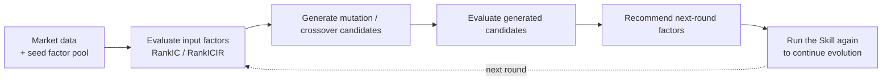

# Factor Pool Evolution

[简体中文](README.md) | **English**

This repository is a Community Project for one-round factor-pool evolution and recommendation.

## Overview

This Skill performs one evolutionary step on an existing factor pool. It starts from seed factors, uses mutation and crossover to generate candidates, evaluates those candidates, and recommends factors for the next round.

## Inspiration

The design is inspired by the CogAlpha idea of understanding factor logic before mutation and crossover:

- [Cognitive Alpha Mining via LLM-Driven Code-Based Evolution](https://arxiv.org/abs/2511.18850)

This project is not a full CogAlpha reproduction. It extracts a lightweight, reusable one-round workflow that users may invoke repeatedly.

## Capabilities

- Accept an existing seed factor pool.
- Evaluate input factors using `RankIC` and `RankICIR`, then select the stronger half as the strong pool.
- Generate mutation tasks for all input factors.
- Pair strong factors with lower-correlation partners for crossover tasks.
- Evaluate and rank generated candidates.
- Recommend factors for another iteration.
- Report correlation diagnostics without using correlation as a hard recommendation filter.

## Usage

On an Agent platform that supports this Skill, provide:

- a market-data CSV;
- the seed factors to use; and
- a request to perform one mutation/crossover round and recommend next-round factors.

Recommended factors from one run can be used as seed factors in a later run.

For local execution:

- `scripts/init_factor_pool.py` creates a demo input package;
- `scripts/run_factor_pool_evolution.py` runs the workflow.

## Minimum Inputs

- A market-data CSV supplied by the user, or a synthetic demo CSV generated by the initialization script.
- An `evolution_input.json` file containing data paths, seed factors, output settings, and evaluation parameters.

When using the bundled Alpha101 / Alpha191 runtime:

- set `seed_alpha_names` in `evolution_input.json`;
- for example, use `alpha101:alpha_001` or `alpha191:alpha_018`;
- no separate `custom_seed_factors.json` is required.

To include user-defined seed factors, additionally provide a `custom_seed_factors.json` file. Some Alpha191 formulas also require `benchmark_csv_path`.

## Documentation

- Input fields: [references/input_schema.md](references/input_schema.md)
- Output artifacts: [references/output_contract.md](references/output_contract.md)
- Mutation and crossover rules: [references/evolution_rules.md](references/evolution_rules.md)

## Runtime Compatibility

- Codex, Claude Code, and OpenClaw: read the root [SKILL.md](SKILL.md).
- Cursor: use [agents/cursor-rule.mdc](agents/cursor-rule.mdc).
- Hermes and other Agents without native Skill discovery: use [agents/portable-loader.md](agents/portable-loader.md).

## License

This project is licensed under the [GNU General Public License v3.0 only](LICENSE), SPDX identifier `GPL-3.0-only`.

Third-party runtime code under `vendor/skill-factor-alpha191-alpha101-main/` retains its original license and attribution.

## Project Status and Boundaries

This repository is a `Community Project` maintained by Lubin Xie.

- Users provide their own market data; the repository does not include real market datasets.
- Results depend on the selected data, universe, seed factors, target horizon, and parameters.
- Outputs are research candidates and require out-of-sample validation, risk analysis, and backtesting.
- This project is for research and educational use only. It does not provide investment advice, promise returns, or represent official QUANTSKILLS validation, certification, endorsement, or production readiness.
