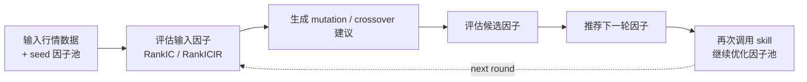

# Factor Pool Evolution

**简体中文** | [English](README.en.md)

这是一个用于一轮因子池进化与推荐的 Community Project。

## 一句话说明

这个 skill 用来对已有因子池做一轮进化式优化：从 seed 因子出发，通过 mutation 和 crossover 生成候选，最后推荐更适合进入下一轮的因子。

## 灵感来源

设计灵感来自 CogAlpha 论文中“先理解因子逻辑，再做 mutation / crossover”的思路：

- [Cognitive Alpha Mining via LLM-Driven Code-Based Evolution](https://arxiv.org/abs/2511.18850)

本项目没有完整复现 CogAlpha，只抽取其中适合复用的一轮 workflow，方便用户反复调用、逐轮优化因子池。

## 这个 skill 能做什么

- 接收一批已有 seed 因子
- 基于 `RankIC / RankICIR` 评估输入因子，排序选出前50%的优秀因子
- 对所有因子生成 mutation，对优秀因子和与之相关性较低的因子做 crossover，获得候选方向
- 统一评估新候选因子并排序
- 推荐下一轮继续使用的因子
- 支持重复调用，进化式地优化因子池

## 怎么使用

在支持这个 skill 的模型里，通常可以直接 prompt：

- 提供一份行情 CSV
- 告诉模型要使用哪些 seed 因子
- 让模型做一轮 mutation / crossover，并推荐下一轮因子

如果您想继续迭代，可以把本轮推荐出的因子作为下一轮 seed 因子，再次调用这个 skill。

如果您是在本地调试脚本：

- `scripts/init_factor_pool.py` 用来初始化 demo 输入
- `scripts/run_factor_pool_evolution.py` 用来执行主流程

## 最少需要什么输入

- 一份行情 CSV（可由用户提供，也可先用 init 脚本生成仅用于流程测试的合成 demo CSV）
- 一份 `evolution_input.json`，用于配置行情数据路径、seed 因子、输出目录和评估参数；init 脚本可以生成 demo 配置

如果您直接用内置的 `Alpha101 / Alpha191` 做 seed 因子：
- 在 `evolution_input.json` 里填写 `seed_alpha_names`
- 例如：`alpha101:alpha_001`、`alpha191:alpha_018`
- 无需额外提供 `custom_seed_factors.json`

如果还要加入自己写的 seed 因子，额外需要：
- 一份 `custom_seed_factors.json`

补充说明：

- skill 已经内置了 `Alpha101 / Alpha191` ，需要时可调用这些因子。
- 某些 `alpha191` 公式如果依赖 benchmark，还需要提供 `benchmark_csv_path`。

## 详细文档

- 输入字段说明：[references/input_schema.md](references/input_schema.md)
- 输出结果说明：[references/output_contract.md](references/output_contract.md)
- mutation / crossover 规则：[references/evolution_rules.md](references/evolution_rules.md)

## 运行时兼容

- Codex、Claude Code、OpenClaw：读取根目录 [SKILL.md](SKILL.md)
- Cursor：使用 [agents/cursor-rule.mdc](agents/cursor-rule.mdc)
- Hermes 或其他不原生识别 Skill 的 Agent：使用 [agents/portable-loader.md](agents/portable-loader.md)

## 许可证

本项目以 [GNU General Public License v3.0 only](LICENSE) 发布，SPDX 标识为 `GPL-3.0-only`。

`vendor/skill-factor-alpha191-alpha101-main/` 中的第三方运行时代码保留其原许可证与来源说明。

## 项目状态与边界

本项目当前属于 `Community Project`。

- 数据来源由用户提供，仓库不附带真实市场数据
- 输出结果仅用于研究与教育，不构成投资建议或收益承诺
- 推荐因子仍需要进一步样本外验证、风险分析与回测确认
- 本项目不代表 QUANTSKILLS 官方验证、认证、背书或生产可用结论
