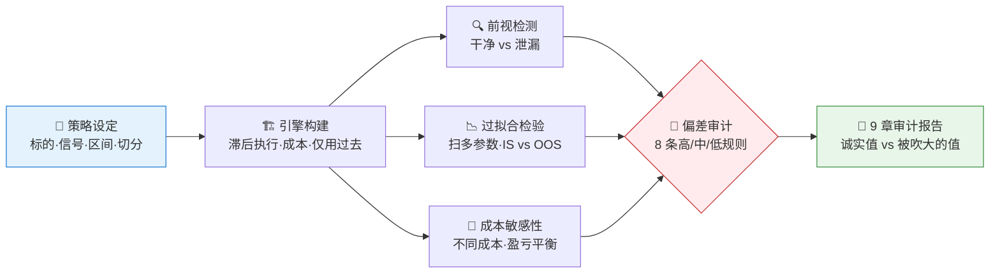
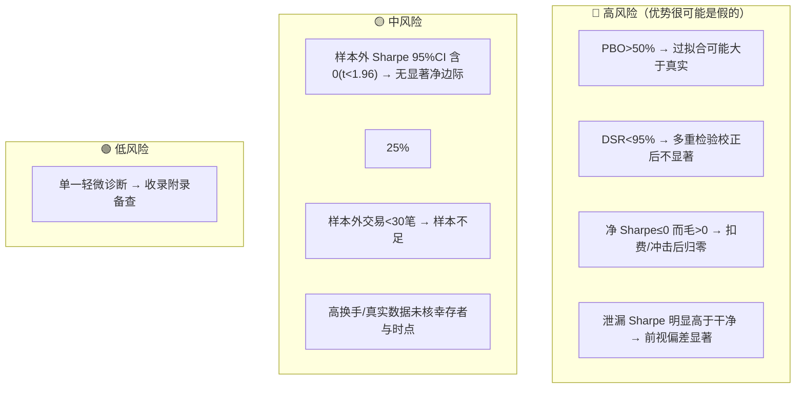

# 🔬 Backtesting & Bias Avoidance Skill

**简体中文** | [English](README.en.md)

> 构建一个无前视偏差的正确回测引擎，并审计前视/幸存者/过拟合等偏差：成本建模、样本外与前推检验、绩效指标一应俱全，一次验明回测是真是假。

<p align="center">
  
  
  
  
  
  
</p>

---

## 📖 这是什么

`backtesting-bias-avoidance` 是一个 **Agent Skill**：搭建一个无前视偏差的回测引擎，并对策略做**偏差审计**。它把回测最容易出错的几类偏差（前视、幸存者、过拟合/数据窥探、成本忽视、多重检验）逐一检测，叠加 **8 条分级审计规则**，最终产出 9 章结构化报告 —— 每个结论都把“诚实结果”和“被偏差吹大的结果”并排摆出来。

它最核心的能力是 **判断回测的优势是真是假**：量化研究里最被低估、最易出错的一步就是这个。一个策略可能仅仅因为忘了滞后一个交易日、用了幸存者清洗过的标的池、或在几百次试验里挑了最好的参数，就在历史上“看起来很美”。本技能默认**假设优势是假的**，直到它扛过无前视、样本外、扣费后的检验。

它用一套严肃的统计工具支撑判断（而非只讲故事）：每个夏普带 **Newey-West HAC** 的 t 值与 95%CI（并报方差膨胀因子、有效样本 N_eff、按持仓段的独立下注口径）；用 **CSCV 跑 PBO**（含自助置信区间）；用 **Deflated Sharpe** 对多重检验做校正（并声明其为乐观上界）。更进一步，**对数百条独立 AR(1) 合成路径重跑整条管线**，把 PBO/DSR/样本外夏普从点值变成**分布**，并给出伪发现率——这是真实数据永远做不到、而合成数据能做的奢侈。成本含**平方根律市场冲击**，并输出**净值与回撤图**。措辞严守纪律：样本外不显著只说“无显著净边际”。

> 默认用合成数据离线运行——**因为你预先知道“真实”边际，才能清楚看到偏差如何凭空造出假业绩**。只依赖 `numpy` / `pandas`，可完整离线验证。

---

## ⚡ 审计流水线



---

## 🧪 五类偏差 × 如何检测

| 偏差 | 是什么 | 本技能怎么暴露它 |
|---|---|---|
| 🕵️ **前视偏差** | 用了决策时还拿不到的未来信息（如忘记滞后） | 同一信号跑 干净(滞后) vs 泄漏(未滞后)，量化夏普被吹大多少 |
| ⚰️ **幸存者偏差** | 标的池剔除了退市/破产标的，高估收益 | 定性核查项：是否含退市标的、成分是否时点对齐 |
| 🎣 **过拟合/数据窥探** | 在同一份数据上挑参数挑策略 | CSCV 多路径跑 **PBO**（过拟合概率）+ **DSR** 对试验次数做校正，不靠单次划分 |
| 💸 **成本忽视** | 不算佣金/价差/滑点/冲击 | 成本敏感性扫描：不同成本下的净夏普与盈亏平衡成本 |
| 🔁 **多重检验** | 报告“多个里最好的那个”而不校正 | 披露试验次数，建议校正或留出确认集 |

---

## 🚨 偏差审计规则引擎

默认规则一览（可由用户阈值覆盖）：



组合信号会被显式命名，例如 `样本外崩塌 + 扫描多参数未校正`、`扣费后归零 + 高换手`。完整规则与阈值见 [`references/backtest-guide.md`](../references/backtest-guide.md)。

---

## 🚀 快速开始

### 1️⃣ 安装

```bash
# 安装运行依赖（默认离线合成数据，无需联网）
pip install numpy pandas scipy matplotlib   # 仅在用真实数据时再加 yfinance

# Claude Code（全局）
cp -r skill-backtesting-bias-avoidance   ~/.claude/skills/backtesting-bias-avoidance

# Codex（全局）
mkdir -p ~/.agents/skills
cp -r skill-backtesting-bias-avoidance   ~/.agents/skills/backtesting-bias-avoidance

# Cursor（项目级）
mkdir -p .cursor/skills
cp -r skill-backtesting-bias-avoidance   .cursor/skills/backtesting-bias-avoidance
```

### 2️⃣ 直接用自然语言提问

```text
帮我演示一下前视偏差能把回测夏普吹大多少
这个动量策略样本外还成立吗？有没有过拟合？
纯噪声数据上，数据窥探能挖出多高的假夏普？
```

### 3️⃣ 不经 Agent 直接跑脚本验证

```bash
cd "Backtesting & Bias Avoidance"
python scripts/run_backtest.py --out 回测审计.md                  # 默认：带真实动量的合成数据
python scripts/run_backtest.py --signal-strength 0.0 --out 纯噪声.md  # 纯噪声：看偏差凭空造假
python scripts/run_backtest.py --source yfinance --symbol AAPL --start 2018-01-01  # 真实数据
```

成功的样子：终端打印 `[done] ... 样本外Sharpe=...(t=...) | PBO=...% | DSR=...% | 前视 ...→... | top=...`，并生成 md 报告。

### 4️⃣ 报告结构（固定 9 章）

```
摘要与结论 → 数据与策略设定 → 回测引擎设定 → 偏差检测：前视偏差 → 过拟合检验:CSCV/PBO
→ 成本敏感性 → 绩效与显著性 → 偏差审计清单 → 方法附录
```

---

## 📦 目录结构

```
Backtesting & Bias Avoidance/
├── SKILL.md                       # 技能入口：工作流、分析规则、质量门槛
├── references/
│   └── backtest-guide.md          # 📒 引擎构建规则、偏差分类与检验、审计阈值、报告蓝图、QA清单
├── scripts/
│   └── run_backtest.py            # 🐍 可执行骨架：无前视引擎→前视(含t值)→CSCV/PBO→DSR→成本敏感性→审计→报告
└── agents/
    └── README.md                  # 📖 本说明文件
```

---

## 📐 核心约束

| 约束 | 说明 |
|---|---|
| 🎯 诚实头条 | 头条=无前视、样本外、**all-in 净（线性+冲击，与成本表一致）**，带 HAC t值/CI、有效样本N_eff 与按下注口径；毛仅用于隔离前视 |
| ⏱️ 杜绝前视 | 信号仅用决策时已知信息，执行滞后一bar，报告写明滞后与执行口径 |
| 📐 HAC显著性 | 夏普用 Newey-West HAC 修正序列相关，并报去通胀因子/N_eff + 按持仓段的独立下注口径，不用 iid SE |
| 🎣 严格测过拟合 | 用 CSCV/PBO 多路径度量，并对扫描出的参数用 DSR 做多重检验校正，不靠单次划分 |
| 💸 成本即证据 | 佣金/价差 + 平方根律市场冲击须建模，毛净并列并给出盈亏平衡成本 |
| ⚰️ 定性必查 | 幸存者与时点偏差无法自动判定，须作为人工核查项明确列出 |
| 📊 多指标+显著性 | Sharpe 配 t值/CI，并辅以 Sortino/最大回撤/Calmar/胜率/DSR，不靠单一数字 |
| 🗣️ 措辞纪律 | 样本外不显著只说“无显著净边际”，绝不写“策略无效”；不下涨跌结论、不用买卖语言 |

---

## ⚠️ 免责声明

本报告基于公开数据与规则化分析生成，仅供研究参考，不构成任何投资建议。

## 📜 License

This project is licensed under the GNU General Public License v3.0. See [LICENSE](LICENSE).
