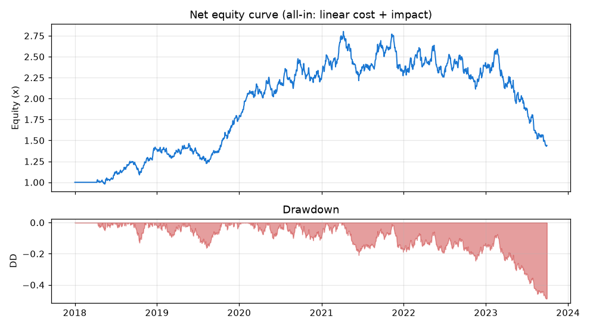

# 回测与偏差审计报告：合成动量演示

> 数据源：`synthetic`｜样本：2018-01-01 ~ 2023-09-29，共 1500 个交易日｜信号：70日动量｜成本：线性5bp + 冲击0.0005｜显著性：Newey-West HAC（带宽=70）

## 1. 摘要与结论
- **诚实结论（样本外·all-in净·无前视·HAC）**：夏普 = **-1.28**（t=-1.57，95%CI=[-2.89, 0.32]）→ **该合成信号无显著净边际**。
  - **显著性两口径**：① HAC：方差膨胀因子 **×1.19**，N_eff = 450/1.19 ≈ **378**；② 按独立下注：样本外仅 **31 笔**（t=-3.08）。二者孰宽取决于段内噪声，并看为准。
  - 这是“未发现正向优势”，**不等于**“策略一定无用”。
- **全样本 all-in 净夏普 = 0.42**（线性5bp+冲击；= 第6章 5bp 行）。
- **PBO = 79%**（CSCV，自助95%CI [74%, 84%]）；**DSR = 46%**（≥25次试验校正，为乐观上界）。
- **前视偏差（毛口径，仅隔离前视）**：忘记滞后使夏普由 0.55 虚高到 1.62。
- **蒙特卡洛（200条独立路径，非单路径点值）**：PBO 中位 57% [5–95%: 18%–87%]，DSR 中位 26% [3%–75%]，样本外显著为正的占比（伪发现率）= **5%**。
- 最高风险等级 **🔴 高**（详见第 8 章）。
- ⚠️ **使用须知**：市场冲击为无 ADV 的平方根律近似；HAC 带宽取信号回看期；DSR 的 25 次试验只含显式窗口扫描，成本/带宽/多空规则等研究自由度未计入，真实自由度更高、故 **PBO 为过拟合下界、DSR 为显著性上界**；幸存者/时点偏差合成数据下不适用、真实数据需另行核对。**仅供学习研究，不可用于真实交易**。

## 2. 数据与策略设定
标的：合成序列（已知真实动量 φ=0.05）；信号：70 日动量；共 1500 天，训练 1050 / 样本外 450（约70/30）；过拟合另用 CSCV 多路径划分。

## 3. 回测引擎设定（防前视 + 成本 + 显著性口径）
| 设定 | 取值 | 作用 |
|---|---|---|
| 决策→执行滞后 | 1 个交易日 | 杜绝未来信息 |
| 线性成本 | 单边 5bp × |Δw| | 佣金+价差 |
| 市场冲击 | 0.0005 × |Δw|^1.5 | 平方根律近似（无ADV） |
| 夏普显著性 | Newey-West HAC，带宽=70 | 修正序列相关，报方差膨胀因子与 N_eff=T/因子 |
| 口径 | 头条=all-in 净；毛仅隔离前视 | 成本与冲击全程进头条 |

## 4. 偏差检测：前视偏差（毛口径，仅隔离前视影响）
| 版本 | 做法 | 年化Sharpe | t(HAC) | 95%CI |
|---|---|---|---|---|
| ✅ 干净（无前视） | 滞后一bar | 0.55 | 1.11 | [-0.42, 1.53] |
| ❌ 泄漏（前视） | 忘记滞后 | 1.62 | 4.58 | [0.92, 2.31] |

忘记滞后一个交易日，夏普凭空增加 1.06（毛口径，隔离前视；含成本净值见第 7 章）。

## 5. 过拟合检验：CSCV/PBO + 蒙特卡洛分布
**单路径 PBO = 79%**（25 个窗口，S=10，252 种划分；自助 95%CI [74%, 84%]，因 252 种划分相互重叠，该 CI 偏窄）。

**蒙特卡洛（200 条独立 AR(1) 路径，同一管线）——把点值变成分布：**
| 量 | 中位数 | 5% | 95% |
|---|---|---|---|
| PBO | 57% | 18% | 87% |
| DSR | 26% | 3% | 75% |
| 样本外净Sharpe | -0.16 | -1.39 | 1.26 |

伪发现率（样本外 HAC 显著为正的路径占比）= **5%**——“样本内挑最优”这一动作，在数百条路径上极少产出真正的样本外正向显著，单路径的 PBO/DSR 只是该分布上的一个抽样。

单路径直观对照（净口径；样本内挑最优 → 样本外验证）：
| 回看窗口 | 样本内Sharpe | 样本外Sharpe |
|---|---|---|
| 5 日 | 0.26 | -0.25 |
| 10 日 | 0.41 | -0.42 |
| 20 日 | 0.95 | -0.51 |
| 40 日 | 0.80 | -0.32 |
| 60 日 | 0.93 | -0.32 |
| 70 日 | 1.28 | -1.28 ⬅样本内最优 |
| 120 日 | 0.57 | -0.40 |

样本内最优 70 日（IS 1.28）样本外仅 -1.28。单路径只是直觉，PBO/蒙卡分布才是严格度量。

## 6. 成本敏感性（含市场冲击；净口径）
| 线性成本(bp) | 全样本净Sharpe |
|---|---|
| 0 | 0.48 |
| 5 | 0.42 ←头条口径 |
| 10 | 0.37 |
| 20 | 0.27 |
| 40 | 0.06 |

（每行均含 0.0005×|Δw|^1.5 冲击。）盈亏平衡线性成本约 ≥40bp。

## 7. 绩效、显著性与净值曲线（all-in 净，全样本）
| 指标 | 数值 |
|---|---|
| 年化收益（净） | 7.84% |
| Sharpe（净, HAC日频） | 0.42（t=0.82, 95%CI=[-0.59, 1.44]） |
| Sharpe（净, 按下注·全样本） | 0.31（n=57笔, t=0.75, CI=[-0.50, 1.11]） |
| 有效样本 N_eff（HAC） | ≈943（= 1500/方差膨胀1.59） |
| 独立下注（IS/OOS/全样本） | 27 / 31 / 57 笔 |
| Sortino（净） | 0.67 |
| 最大回撤（净） | -48.95% |
| Calmar（净） | 0.16 |
| 胜率 | 50.3% |
| Deflated Sharpe (DSR) | 46%（基准 SR₀=0.029/期，≥25次试验，乐观上界） |

**换手率诊断**：IS 0.026/天 vs OOS 0.069/天（OOS 约 2.7 倍）——样本内趋势(少翻仓)、样本外被反复打脸(频繁翻仓)，是过拟合/换regime的指纹。

**净值与回撤**（-49.0% 的回撤集中在少数区间，故附图判断是否被一两段行情主导）：

## 8. 偏差审计清单
| 风险等级 | 信号 | 触发规则 | 证据 |
|---|---|---|---|
| 🔴 高 | 过拟合概率高 | PBO>50% | PBO=79%（自助95%CI [74%,84%]） |
| 🔴 高 | 多重检验后不显著 | DSR<95% | DSR=46%（≥25次试验，为乐观上界） |
| 🔴 高 | 前视偏差显著 | 泄漏>>干净(毛) | 0.55→1.62 |
| 🟡 中 | 样本外无显著净边际 | HAC 95%CI 含 0 | t=-1.57, CI=[-2.89,0.32] |
| 🟡 中 | 有效样本/独立下注偏少 | 独立下注<35 或 N_eff小 | 下注≈31笔, HAC N_eff≈378（方差膨胀×1.19） |

**定性核查项（需人工确认）**：
- 幸存者偏差：标的池是否含已退市/破产标的？
- 时点对齐：价格/财务/成分是否为当时真实可得？
- 研究自由度：真实尝试过的成本/带宽/规则数（影响 DSR）是否已如实计入？

## 9. 方法附录
| 分析阶段 | 方法 | 窗口/样本 | 结果 |
|---|---|---|---|
| 显著性 | Newey-West HAC（带宽=70）+ 按下注 | 全样本 | 净 t=0.82, N_eff≈943, 方差膨胀×1.59 |
| 前视检测 | 干净vs泄漏（毛） | 全样本 | 0.55→1.62 |
| 过拟合 | CSCV/PBO + 自助CI | 252划分 | PBO=79% [74%,84%] |
| 蒙特卡洛 | 200条AR(1) | 多路径 | PBO中位57%, 伪发现率5% |
| 多重检验 | Deflated Sharpe | ≥25次试验 | DSR=46%（上界） |
| 成本 | 线性+平方根冲击 | 全样本 | 平衡≈≥40bp |

---
本报告基于公开数据与规则化分析生成，仅供研究参考，不构成任何投资建议。