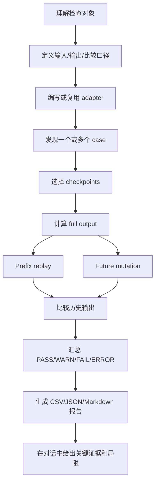

# skill-numerical-leak-check

数值型未来泄露检查 skill。它把“前缀重放 + 未来扰动”的数值因果性测试方法交给 agent，用于检查时间序列计算、量化因子、特征工程、标签生成、回测信号或研究管线中是否存在未来信息泄露。

这个 skill 是 generic 的：不假定固定因子函数、固定 schema、固定资产类别或固定输出列。用户可以通过 adapter 把任意项目对象接入检查。

## Workflow



## 支持批量检测

adapter 的 `discover_cases(config)` 可以返回多个 case，因此可以一次性检测：

- 一批因子文件
- 一批特征生成任务
- 一批标签生成任务
- 多个参数组合
- 多个市场、品种、股票池或 pipeline 节点

runner 会按 case 汇总最坏状态，并输出批量报告。

## 主要产物

```text
<out_dir>/
├── leak_check_results.csv
├── leak_check_results.json
├── leak_check_summary.json
└── leak_check_report.md
```

## 快速开始

```bash
python scripts/init_leak_check_case.py /tmp/leak_check_case

python scripts/run_numerical_leak_check.py \
  --adapter /tmp/leak_check_case/leak_check_adapter.py \
  --config /tmp/leak_check_case/leak_check_config.json \
  --out-dir /tmp/leak_check_run \
  --workers 1
```

初始化生成的 adapter 是模板，需要按项目实际输入和目标计算补全。

## 示例

`examples/` 里提供了一个可直接运行的批量盲测示例：

`examples/factors/` 包含两个中性命名的因子文件，其中一个存在未来泄露，另一个没有。文件名和 README 不标注答案，适合让另一个 agent 独立判断。

```bash
cd examples
python ../scripts/run_numerical_leak_check.py \
  --adapter leak_check_adapter.py \
  --config leak_check_config.json \
  --out-dir runs/convolve_example \
  --workers 1
```

因为示例包含一个故意泄露的因子，runner 返回码预期为 `1`。

## Runtime Entry Points

| Runtime | Entry |
|---|---|
| Codex / Claude Code | `SKILL.md` |
| Cursor | `agents/cursor-rule.mdc` |
| Hermes / OpenClaw / portable agents | `agents/portable-loader.md` |

## 许可证

GPL-3.0-only。
